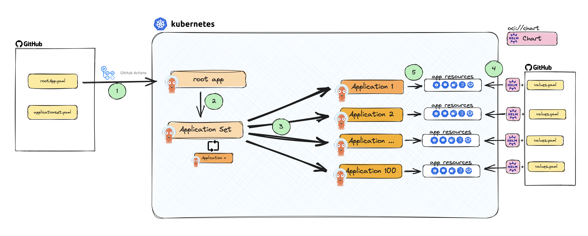
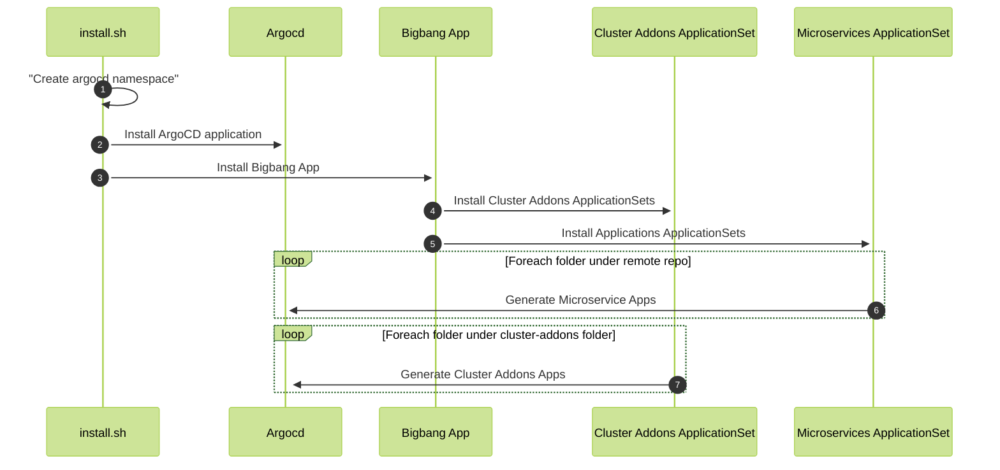
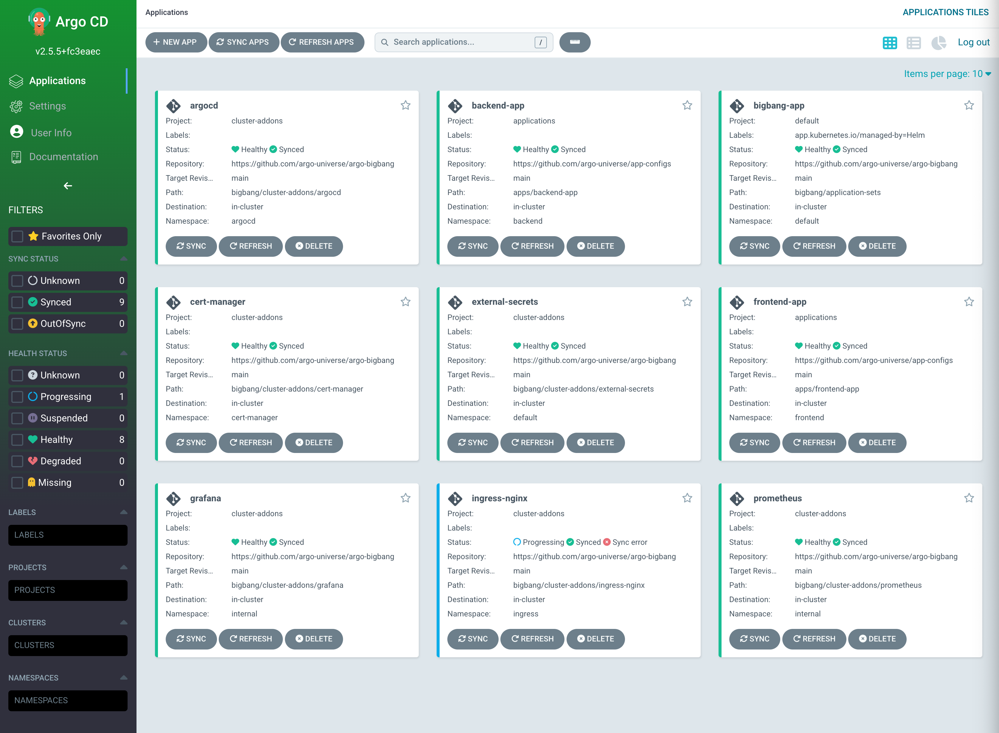
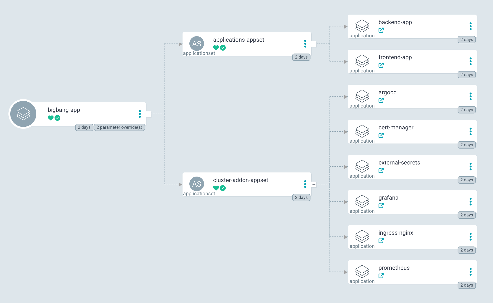

# Argo-Bigbang

[](https://github.com/argo-universe/argo-bigbang/blob/master/LICENSE)


Argo-Bigbang is a boilerplate used to deploy your entire assets with single command using ArgoCD elegantly. This repository will deploy all the basic components of a common Kubernetes cluster and a sample microservice to provide insight into the architecture of GitOps. By manually executing the shell script or executing it through a pipeline, you will be able to deploy all the required components for your cluster.

These are the basic components that will be deployed, but not limited to:

- nginx-ingress
- external secrets
- apps
    - [frontend](https://github.com/argo-universe/frontend-app)
    - [backend](https://github.com/argo-universe/backend-app) 

> the microservice will be deployed from a separate repository to keep the cluster from the applications.


-----

## Component Diagram

 **INFO:** Since the applicationset is configuret to generate an application for each folder in cluster addons. If you need to deploy another component just create a folder with environment value file




---

## Sequence Diagram



---


#### Folder Structure of Cluster-addons and Environment Variables

Every cluster addon has several environment files. When the application set tries to deploy addons or microservices, it looks for two files. The first one is the values.default.yaml file, and the second file is /[environment]/values.yaml file. The environment file will override the values on the values.default.yaml file.

If you want to disable the cluster addons for any env just rename the value file as `values.disabled.yaml`

```
.
├── LICENSE
├── README.md
└── cluster-addons
    ├── Add-on_1
    │   ├── dev
    │   │   ├── Chart.yaml
    │   │   ├── templates
    │   │   └── values.yaml
    │   ├── prod
    │   │   ├── Chart.yaml
    │   │   ├── templates
    │   │   │   ├── Additional_manifest.yaml
    │   │   │   └── Additional_manifest2.yaml
    │   │   └── values.yaml
    │   └── values.default.yaml
    └── Add-on_2
        ├── dev
        │   ├── Chart.yaml
        │   └── values.disabled.yaml
        ├── prod
        │   ├── Chart.yaml
        │   └── values.yaml
        └── values.default.yaml
```

---
## Installation
### Local Installation

To perform local testing, you can utilize not limited but either  [Minikube](https://minikube.sigs.k8s.io/docs/start/). or [Kind](https://kind.sigs.k8s.io/docs/user/quick-start/#installation). can be used.

Once you have installed Kubernetes locally, follow these steps:

Clone the bigbang repository and execute the install script:

```bash
git clone https://github.com/argo-universe/argo-bigbang.git
cd argo-bigbang

# dev is just the name of the envriontment identification it could be anything etc. Mydev, staging or prod
./install.sh dev 
```
> We suggest you to fork the repos (big-bang, cluster-addons, app-configs, backend-app and frontend-app ) so that you can easily test it

```bash
git clone https://github.com/<your_github_account>/argo-bigbang.git
cd argo-bigbang

# dev is just the name of the envriontment identification it could be anything etc. Mydev, staging or prod
./install.sh dev your_github_account
```


> **Iportant:**: If you set the environment identifier as 'abc', ensure that the respective environment variable files are configured in the 'cluster-addons' and 'app-configs/apps' folders.

after the execution of the script all the resources will be generated and script will give you the argocd default admin password.

```bash
❯ ./install.sh dev
namespace/argocd created
Release "argocd" does not exist. Installing it now.
NAME: argocd
LAST DEPLOYED: Fri May 12 22:01:43 2023
NAMESPACE: argocd
STATUS: deployed
REVISION: 1
TEST SUITE: None
Waiting for Deployment to be ready...
deployment.apps/argocd-server condition met
Release "bigbang-app" does not exist. Installing it now.
NAME: bigbang-app
LAST DEPLOYED: Fri May 12 22:02:20 2023
NAMESPACE: argocd
STATUS: deployed
REVISION: 1
TEST SUITE: None
ArgoCD admin password is cDuhncyhbQspLJDO
```


### Vault Configuration

You have the option to utilize the `vault_init.sh` file to manage the initialization and unsealing process of Vault. Simply execute the command `./vault_init.sh` or refer to the instructions provided below.

To automate secret creation, we have configured HashiCorp Vault. However, before you can proceed, you need to unseal the Vault and create the required secrets.

**Unseal HashiCorp Vault**
Access the vault-0 pod:
```bash
kubectl exec -it vault-0 -- /bin/sh -n vault
```

Execute the following command within the pod to initialize the Vault:
```bash
vault operator init
# This command generates seal secrets and a root token
```
Use the unseal command to unseal the Vault:
```bash
vault operator unseal
```


Once you have unsealed the Vault, it will start running as expected. Proceed to execute the following script:

**Execute Vault Configuration Script**

Run the following script and pass the root token received previously (e.g., hvs.MhxaUBafEEERWEEfw3sChsUO5):
```bash
# pass the root token that youreceive previously something like this hvs.MhxaUBafEEERWEEfw3sChsUO5
./vault.config.sh <root token>
```

If you have configured an ingress for your Vault, use the endpoint to log in to Vault. Otherwise, you can use port forwarding to access the Vault UI.

Create Secrets
Enable the KV engine for secrets management:
```bash
vault secrets enable -path=kv kv
```

Create your desired secrets under the KV engine. For example, create a secret called dex_github_clientSecret with the value of your GitHub token for single sign-on (SSO):

```bash
vault kv put kv/dex_github_clientSecret secret=your_github_token_for_sso
```

This secret (dex_github_clientSecret) will be used to enable ArgoCD single sign-on.

Please follow the steps above to configure and manage secrets in HashiCorp Vault.


### Cloud Services Installation

##### AWS
TBD

## Usage
with port-forward script you can see the argocd UI on your browser

```bash 
kubectl port-forward svc/argocd-server -n argocd 8080:80
```
visit [http://localhost:8080](http://localhost:8080)




 
## Contributing

We welcome issues and PRs!
