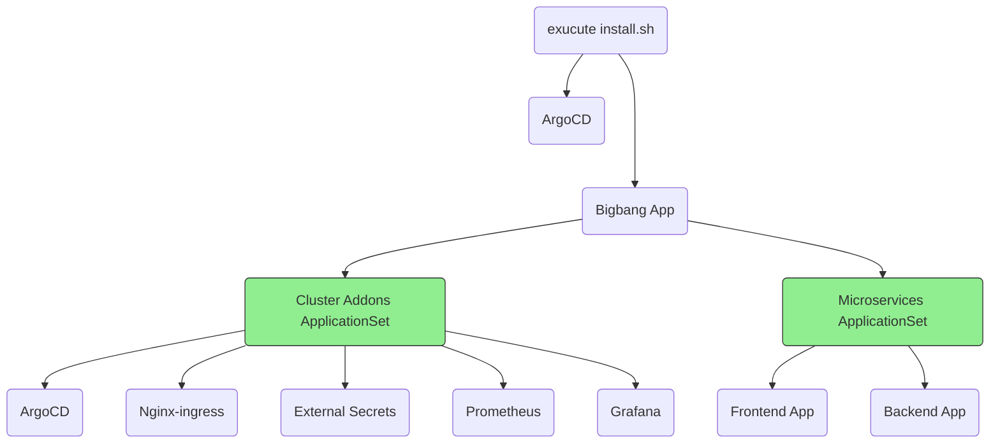
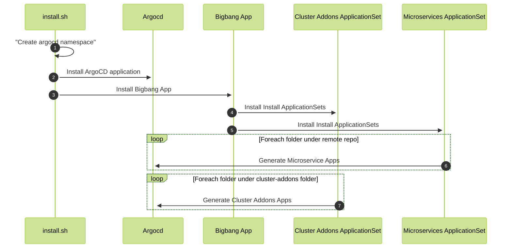

# Argo-Bigbang

[](https://github.com/argo-universe/argo-bigbang/blob/master/LICENSE)


Argo-Bigbang is a boilerplate used to deploy your entire assets with single command using ArgoCD elegantly. This repository will deploy all the basic components of a common Kubernetes cluster and a sample microservice to provide insight into the architecture of GitOps. By manually executing the shell script or executing it through a pipeline, you will be able to deploy all the required components for your cluster.

These are the basic components that will be deployed, but not limited to:

- nginx-ingress
- external secrets
- a sample microservice
  - the microservice will be deployed from a separate repository to keep the cluster from the applications.

Once the installation script is executed, the resources below will be installed automatically.

#### Component Diagram

> **INFO:** Since the applicationset is configuret to generate an application for each folder in cluster addons. If you need to deploy another component just create a folder with environment value file



### Sequence Diagram



#### Folder Structure of Cluster-addons and Environment Variables

Every cluster addon has several environment files. When the application set tries to deploy addons or microservices, it looks for two files. The first one is the values.yaml file, and the second file is values.**[environment]**.yaml file. The environment file will override the values on the values.yaml file.

```
./cluster-addons
├── argocd
│   ├── Chart.lock
│   ├── Chart.yaml
│   ├── values.dev.yaml
│   ├── values.prod.yaml
│   ├── values.qa.yaml
│   ├── values.staging.yaml
│   └── values.yaml
├── external-secrets
│   ├── Chart.lock
│   ├── Chart.yaml
│   ├── values.dev.yaml
│   ├── values.prod.yaml
│   ├── values.qa.yaml
│   ├── values.staging.yaml
│   └── values.yaml
└── ingress-nginx
    ├── Chart.lock
    ├── Chart.yaml
    ├── values.dev.yaml
    ├── values.prod.yaml
    ├── values.qa.yaml
    ├── values.staging.yaml
    └── values.yaml
```
## Installation
### Local Installation

To perform local testing, you can utilize not limited but either  [Minikube](https://minikube.sigs.k8s.io/docs/start/). or [Kind](https://kind.sigs.k8s.io/docs/user/quick-start/#installation). can be used.

Once you have installed Kubernetes locally, follow these steps:

Clone the bigbang repository and execute the install script:

```bash
git clone https://github.com/argo-universe/argo-bigbang.git
cd argo-bigbang

# dev is just the name of the envriontment identification it could be anything etc. Mydev, staging or prod
./install.sh dev 
```

> **Iportant:**: If you set the environment identifier as 'abc', ensure that the respective environment variable files are configured in the 'cluster-addons' and 'app-configs/apps' folders.

after the execution of the script all the resources will be generated and script will give you the argocd default admin password.

```bash
❯ ./install.sh dev
namespace/argocd created
Release "argocd" does not exist. Installing it now.
NAME: argocd
LAST DEPLOYED: Fri May 12 22:01:43 2023
NAMESPACE: argocd
STATUS: deployed
REVISION: 1
TEST SUITE: None
Waiting for Deployment to be ready...
deployment.apps/argocd-server condition met
Release "bigbang-app" does not exist. Installing it now.
NAME: bigbang-app
LAST DEPLOYED: Fri May 12 22:02:20 2023
NAMESPACE: argocd
STATUS: deployed
REVISION: 1
TEST SUITE: None
ArgoCD admin password is cDuhncyhbQspLJDO
```


## Usage
with port-forward script you can see the argocd UI on your browser

```bash 
kubectl port-forward svc/argocd-server -n argocd 8080:80
```
visit [http://localhost:8080](http://localhost:8080)


 
## Contributing

We welcome issues and PRs!
