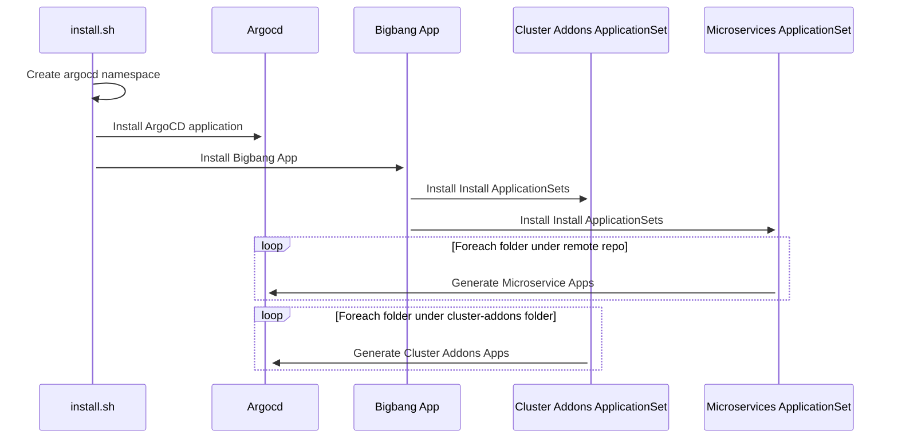

# Argo-Bigbang
[](https://github.com/makdeniz/argo-bigbang/blob/master/LICENSE)

 

Argo-Bigbang is a boilerplate used to deploy your entire assets with single command using ArgoCD elegantly. This repository will deploy all the basic components of a common Kubernetes cluster and a sample microservice to provide insight into the architecture of GitOps. By manually executing the shell script or executing it through a pipeline, you will be able to deploy all the required components for your cluster.

These are the basic components that will be deployed, but not limited to:

* nginx-ingress
* external secrets
* a sample microservice
    * the microservice will be deployed from a separate repository to keep the cluster from the applications.
    
Once the installation script is executed, the resources below will be installed automatically.

#### Component Diagram
> **INFO:** Since the applicationset is configuret to generate an application for each folder in cluster addons. If you need to deploy another component just create a folder with environment value file 


### Sequence Diagram


  


#### Folder Structure and Environment Variables

Every cluster addon has several environment files. When the application set tries to deploy addons or microservices, it looks for two files. The first one is the values.yaml file, and the second file is values.**[environment]**.yaml file. The environment file will override the values on the values.yaml file.


## Installation

 run install.sh file with environment name
``` bash
 $ ./install.sh dev
```
## Usage

depending on your configuration use portforward or ingress to access argocd UI.

## License

This project is licensed under the [MIT License](https://opensource.org/licenses/MIT).

## Contributing

We welcome issues and PRs!